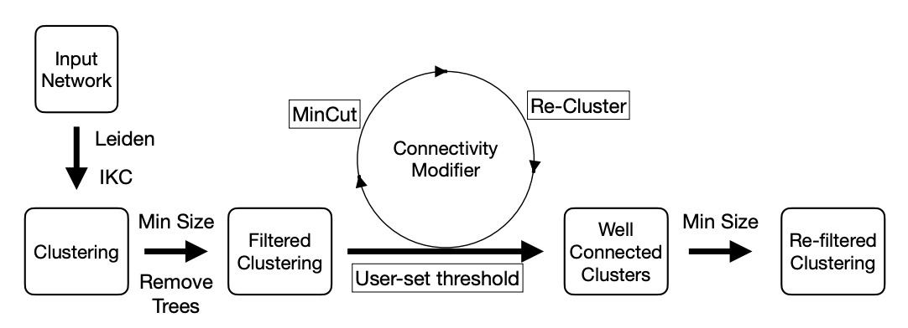

# cm_pipeline
Modular pipeline for testing and using an improved version of CM for generating well-connected clusters.
- [cm\_pipeline](#cm_pipeline)
  - [Overview](#overview)
  - [Major Release Notes](#major-release-notes)
    - [CM++ (v3.3)](#cm-v33)
    - [CM++ (v3.0)](#cm-v30)
    - [CM+ (v2.1)](#cm-v21)
    - [CM (Pipeline) (v1.2)](#cm-pipeline-v12)
    - [CM (Base)](#cm-base)
  - [Input and Usage Instructions](#input-and-usage-instructions)
    - [JSON Input Documentation](#json-input-documentation)
  - [Requirements](#requirements)
    - [UIUC EngrIT Systems](#uiuc-engrit-systems)
  - [Setup and Running Instructions](#setup-and-running-instructions)
    - [How to Clone CM for any particular version](#how-to-clone-cm-for-any-particular-version)
  - [Output Files](#output-files)
  - [Citation](#citation)
  - [TODOs:](#todos)

## Overview 


## Major Release Notes
### CM++ (v3.3)
**JSON Pipeline**  
- Introduction of a much cleaner JSON pipeline to run generalized clustering procedures.  
  
**Algorithmic fixes of CM**   
- Correct handling of disconnected clusters (0-connectivity)
- Fixed definition of `extant` parameter
    - `extant`: CM-valid clusters that were untouched by CM
    - `cm_valid`: What `extant` was originally &mdash; a cluster that does not need to be operated on by CM anymore   
   
**Functional changes in CM**   
- Removed `--labelonly` parameter. CM2Universal is essential so there shouldn't be a parameter that silences it. Rather, we introduce a new parameter:
    - `-f` or `--firsttsv`: Include the original tsv, pre-CM2Universal. This tsv defaults to not being outputted when the tag is omitted
    - JSON2Membership is now integrated with CM++ and the default tsv being outputted comes from the `after.json` that results from CM2Universal. 
### CM++ (v3.0) 
**Parallelism introduced in this version.**  

Commands from v2.0 stay consistent, except now you can add the following options

- `-n <number of parallel processes>` or `--nprocs <number of parallel processes>`: Specify number of processes to create to run CM++ in parallel. _Default_ 4
- `-l` or `--labelonly`: Don't output a tree and don't run CM2Universal. _Default_ without this tag, CM will automatically output a tree and run CM2Universal
### CM+ (v2.1)
- Enabled the option to run the clustering for multiple n values
- Removed the support for runleiden
- Integrated the leidenalg wrapper
- Users can choose between runleiden and leidenalg with number_of_iterations
- If `clustering_script` is not specified in. the `param.config` then by default `leidenalg` is used with default `number_of_iterations` equals to 2.
- _CM_
     - Added Python wrapper for VieCut to avoid overhead in fork-exec-wait paradigm
     - Replaced MincutResult object with python-mincut C++ object
     - Shortened mincut computation in CM
### CM (Pipeline) (v1.2)
- **Introduction of modular pipeline**
- Post cm filtering to remove clusters of size 10
- Set the filtering of clusters size to `N>1` in analysis scripts
- Introduced `--quiet` or `-q` param
### CM (Base)
- Refer to [this link](https://github.com/RuneBlaze/connectivity-modifier)

## Input and Usage Instructions
- The input to the pipeline script is a [pipeline.json](pipeline.json) file. **NOTE** that you can use any other json file as input as long as it fit
- Description of the supported key-value pairs in the config file can be found here [pipeline_template.json](docs/pipeline_template.json)
- Edit the fields of the `pipeline.json` file to reflect your inputs and requirements.
- Run `python -m main pipeline.json`
### JSON Input Documentation
- Please refer to the [documentation](docs/json_format.md) on how to write the `pipeline.json` file.

## Requirements
- Create a python venv with 3.9 or above version. We are using python3.9
     - Activate the venv and run "pip install -r requirements.txt"
- `cmake` version `3.2.0` and above should be installed.
- `python39-devel` or higher should be installed, e.g., dnf install python39-devel 
- `openmpi` and `gcc` of any version
     - In our analysis, `openmpi 4.2.0` and `gcc 9.2.0` were used. The code works with gcc 8.5 too in an Oracle Linux 8 environment.
### UIUC EngrIT Systems
- These instructions are specific for users on an EngrIT cluster (such as Valhalla or the Campus Cluster) under the University of Illinois at Urbana-Champaign
- You can get all the needed packages to run the pipeline via the following commands
```bash
module load python3/3.10.0
module load cmake/3.25.1
module load gcc/9.2.0
module load openmpi/4.0.1
```
**NOTE: These need to be loaded not just on installation but on execution of the CM pipeline**
  
## Setup and Running Instructions
- Clone the cm_pipeline repository
- Activate the venv which has the necessary packages 
- Simply run `./setup.sh`
- *Alternatively*
     - Set up `python-mincut`:
          - Initiate the submodules via the following commands being run from the root of this (cm_pipeline) repository
          ```bash
          git submodule update --init --recursive
          cd hm01/tools/python-mincut
          mkdir build
          cd build
          cmake .. && make
          cd ../../../..
          ```
     - Set up `cluster-statistics` and the `python-mincut` within the `cluster-statistics` submodule:
          - Run the following commands
          ```bash
          cd cluster-statistics/tools/python-mincut
          mkdir build
          cd build
          cmake .. && make
          cd ../..
          ```
<!--
- Edit the `network_name`, `output_dir`  and `resolution` values in `[default]` section of [param.config](param.config); and `input_file` under `[cleanup]` section of the cloned repository (‘~’ is allowed for user home in the `output_dir` path and this directory need not exist)
-->
- Edit the fields of the `pipeline.json` file to reflect your inputs and requirements. Please refer to the documentation on how to write the `pipeline.json` file.
- Run `python -m main pipeline.json`

### How to Clone CM for any particular version
Simply run the following
```
git clone -b v<version #> https://github.com/illinois-or-research-analytics/cm_pipeline.git .
```

<!--
## Setting the levels for logging
- cm pipeline logs the data on to console and file.
- Log levels for each of these can be modified in [log.config](./log.config)
- Log levels: DEBUG, INFO, WARNING, ERROR, CRITICAL [logging levels](https://docs.python.org/3/library/logging.html#logging-levels)
- Log files are created in `./logs` directory.
-->

## Output Files
- The commands executed during the workflow are captured in `{output_dir}/{run_name}-{timestamp}/commands.sh`. This is the shell script generated by the pipeline that is run to generate outputs. 
- The output files generated during the workflow are stored in the folder `{output_dir}/{run_name}-{timestamp}/`
- The descriptive analysis files can be found in the folder `{output_dir}/{run_name}-{timestamp}/analysis` with the `*.csv` file for each of the resolution values.

<!--
- The commands executed during the workflow are captured in `./logs/executed-cmds/executed-cmds-timestamp.txt`
- The Output files generated during the workflow are stored in the folder `user-defined-output-dir/network_name-cm-pp-output-timestamp/`
- The descriptive analysis files can be found in the folder `user-defined-output-dir/network_name-cm-pp-output-timestamp/analysis` with the `*.csv` file for each of the resolution values.

## Note:
- At present the new version of `CM` is by default executed in quiet mode. If you want to run it in verbose mode then 
comment out the [--quiet](https://github.com/illinois-or-research-analytics/cm_pipeline/blob/main/source/connectivity_modifier_new.py#:~:text=cm.py%22%2C-,%22%2D%2Dquiet%22%2C,-%22%2Di%22%2C) argument in [source/connectivity_modifier_new.py](source/connectivity_modifier_new.py). Better still, request the ability to turn it on and off easily.

## References
- [https://engineeringfordatascience.com/posts/python_logging/](https://engineeringfordatascience.com/posts/python_logging/)
- [https://docs.python.org/3/library/logging.config.html#logging-config-fileformat](https://docs.python.org/3/library/logging.config.html#logging-config-fileformat)
-->

## Citation
```
@misc{cm_pipe2023,
  author = {Vidya Kamath and Vikram Ramavarapu and Fabio Ayres, and George Chacko},
  title = {Connectivity Modifier Pipeline},
  howpublished = {\url{https://github.com/illinois-or-research-analytics/cm_pipeline}},
  year={2023},
}
```

## TODOs:
- Support to run the workflow with individual stages (as opposed to "end to end")
- Add fraction of clusters untouched by the central CM module of pipeline in the analysis file.
- Mechanism to sync the scripts used within cm_pipeline with the latest changes.
- Add more log messages in the source code for different levels (Currently INFO, DEBUG, ERROR log messages are added). 


