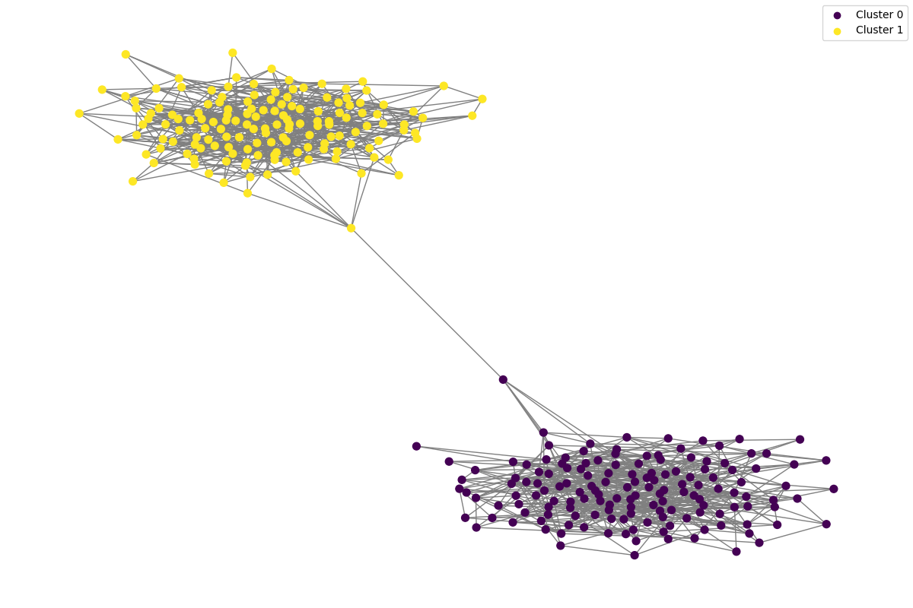

# Quick Start Guide

## Running CM++

Suppose you have a network and a clustering of the network that you want to refine. For this tutorial, I will use the following network and clustering.

- [network.tsv](examples/network.tsv)
- [clustering.tsv](examples/clustering.tsv)

You know that these clusters aren't well-connected, and you want to use CM++ to enforce better connectivity.

### Visualizing the Data

First, you can visualize the graph and clustering. This can be done via the following Python script:

```python
import matplotlib.pyplot as plt
import networkx as nx
import pandas as pd

# Load the clustering data
clustering_file = 'clustering.tsv'
clustering_data = pd.read_csv(clustering_file, sep='\t', header=None, names=['node_id', 'cluster_id'])

# Load the edge list data
edge_list_file = 'network.tsv'
G = nx.read_edgelist(edge_list_file, delimiter='\t', nodetype=int)

# Assign cluster IDs to nodes in the graph
node_cluster_mapping = dict(clustering_data.values)
nx.set_node_attributes(G, node_cluster_mapping, 'cluster')

# Generate a color map for clusters
unique_clusters = set(node_cluster_mapping.values())
color_map = plt.cm.get_cmap('viridis', len(unique_clusters))
colors = {cluster: color_map(i) for i, cluster in enumerate(unique_clusters)}

# Assign color to each node based on cluster
node_colors = [colors[node_cluster_mapping[node]] for node in G.nodes()]

# Plot the graph
plt.figure(figsize=(12, 8))
nx.draw(G, node_color=node_colors, with_labels=False, node_size=50, edge_color='gray')
plt.savefig('patitions.png')
plt.show()
```

Running this script results in the following:



### Installing and Running CM++

CM++ can form these into well-connected clusters. Firstly, CM++ can be quickly installed with the following command:

`pip install git+https://github.com/illinois-or-research-analytics/cm_pipeline`

If you want all clusters to have a connectivity above `log10(n)` (all clusters have a mincut value above log10 of the number of nodes in the cluster), you can run the command below:

`python3 -m hm01.cm -i network.tsv -e clustering.tsv -o out.tsv -c leiden -g 0.5 -t 1log10`

### Visualize Post-CM Clustering

CM++ pruned some nodes from this clustering to form well-connected clusters. You can visualize the clustering through the following script:

```python
import matplotlib.pyplot as plt
import networkx as nx
import pandas as pd

# Load the clustering data
clustering_file = 'out.tsv'
clustering_data = pd.read_csv(clustering_file, sep='\t', header=None, names=['node_id', 'cluster_id'])

# Load the edge list data
edge_list_file = 'network.tsv'
G = nx.read_edgelist(edge_list_file, delimiter='\t', nodetype=int)

# Assign cluster IDs to nodes in the graph
node_cluster_mapping = dict(clustering_data.values)
nx.set_node_attributes(G, node_cluster_mapping, 'cluster')

# Generate a color map for clusters
unique_clusters = set(node_cluster_mapping.values())
color_map = plt.cm.get_cmap('viridis', len(unique_clusters))
colors = {cluster: color_map(i) for i, cluster in enumerate(unique_clusters)}
colors['pruned'] = (0.7, 0, 0)

# Assign color to each node based on cluster
node_colors = [(0.7, 0, 0) if node not in node_cluster_mapping else colors[node_cluster_mapping[node]] for node in G.nodes()]

# Plot the graph
plt.figure(figsize=(12, 8))
nx.draw(G, node_color=node_colors, with_labels=False, node_size=50, edge_color='gray')

# Create a legend
plt.scatter([], [], c=colors['0\u03B4'], label='Cluster 0\u03B4')
plt.scatter([], [], c=colors['1\u03B4'], label='Cluster 1\u03B4')
plt.scatter([], [], c=colors['pruned'], label='Pruned nodes')

plt.legend()
plt.savefig('patitions2.png')
plt.show()
```

Resulting in the following visualization:


The red nodes are nodes that have been pruned off by CM++ to make clusters well-connected.

## Running CM Pipeline

Suppose now, you do not have a clustering, and you want to compute statistics on these clusters. Then, you must run the CM Pipeline.

### Installing the CM Pipeline

A pip install alone is not sufficient for the entire pipeline. The pipeline can be installed via Git cloning:

- Clone the cm_pipeline repository
- Activate the venv which has the necessary packages
- Run `pip install -r requirements.txt && pip install .`
- Make sure everything installed properly by running `cd tests && pytest`

### Downloading the Data

For this tutorial, I will use the following network

- [network.tsv](examples/network.tsv)

### Constructing the Pipeline

In order to make a pipeline with the following stages,

1. Clustering
2. Compute Statistics
3. CM++
4. Compute Statistics

in the root of the repository, create a `pipeline.json` file like the following:

```json
{
    "title": "example-leiden",
    "name": "example",
    "input_file": "/path/to/network.tsv",
    "output_dir": "samples/",
    "algorithm": "leiden",
    "params": [{
        "res": 0.01,
        "i": 2
    }],
    "stages": [
        {
            "name": "clustering"
        },
        {
            "name": "stats"
        },
        {
            "name": "connectivity_modifier",
            "threshold": "1log10"
        },
        {
            "name": "stats"
        }
    ]
}
```

Replace `"input_file"` with the path to the `network.tsv` file. This path can be relative to the `pipeline.json` file or absolute. The `"title"` and `"name"` fields exist for output nomenclature and can be arbitrarily renamed.

### Running the Pipeline

Once a `pipeline.json` file is ready, from the root of the repository, simply run:

```python3 -m main pipeline.json```

### Results

When running the pipeline, you should get the outputs in a directory called `samples/(name)-leiden-(timestamp)/` where `name` is replaced with the name of the run and the `timestamp` is the time at which the CM Pipeline was run.

#### Before CM++

You should result in statistics like the following:

|cluster|n  |m   |modularity         |cpm_score|connectivity|connectivity_normalized_log10(n)|connectivity_normalized_log2(n)|connectivity_normalized_sqrt(n)/5|conductance       |
|-------|---|----|-------------------|---------|------------|--------------------------------|-------------------------------|---------------------------------|------------------|
|0      |150|555 |0.2492196158940795 |443.25   |2.0         |0.9190791018883572              |0.2766703780563079             |0.8164965809277261               |0.0009000900090009|
|1      |150|598 |0.24921961589407954|486.25   |2.0         |0.9190791018883572              |0.2766703780563079             |0.8164965809277261               |0.0009000900090009|
|Overall|300|1154|0.4984392317881591 |929.5    |            |                                |                               |                                 |                  |

Notice how the connectivity normalized by `log10(n)` is less than 1, indicating that the clusters have mincuts less than the log of the number of nodes. Therefore, they aren't well connected.

#### After CM++

|cluster|n  |m   |modularity         |cpm_score|connectivity|connectivity_normalized_log10(n)|connectivity_normalized_log2(n)|connectivity_normalized_sqrt(n)/5|conductance       |
|-------|---|----|-------------------|---------|------------|--------------------------------|-------------------------------|---------------------------------|------------------|
|1δ     |149|596 |0.2483846030234675 |485.74   |3.0         |1.380461511102679               |0.4155603227015324             |1.2288478807785608               |0.0026954177897574125|
|0δ     |149|553 |0.24832002468994893|442.74   |3.0         |1.380461511102679               |0.4155603227015324             |1.2288478807785608               |0.002705139765554554|
|Overall|300|1154|0.4967046277134164 |928.48   |            |                                |                               |                                 |                  |

As you can see, nodes have been pruned, and the mincut values have increased. The normalized mincut value to `log10(n)` is now above 1, meaning it fits the connectivity threshold.